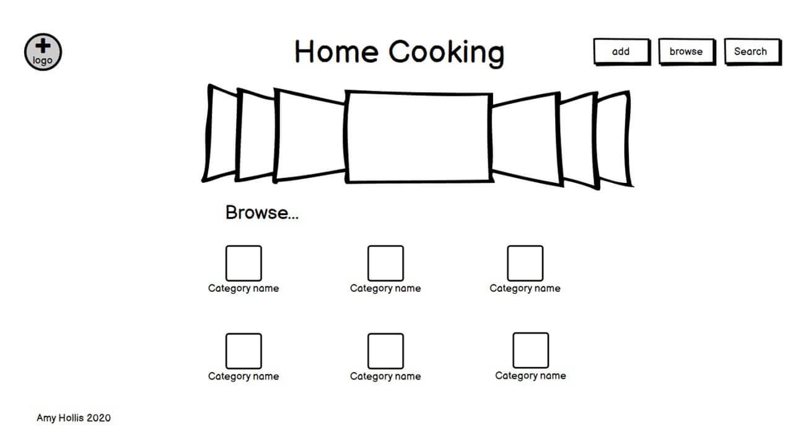
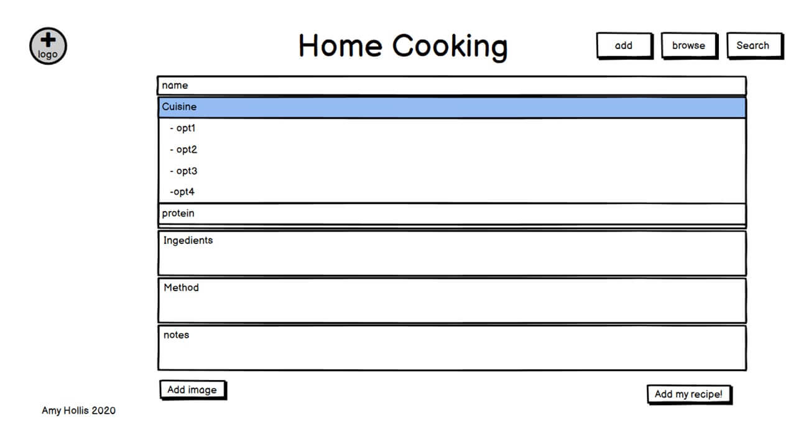
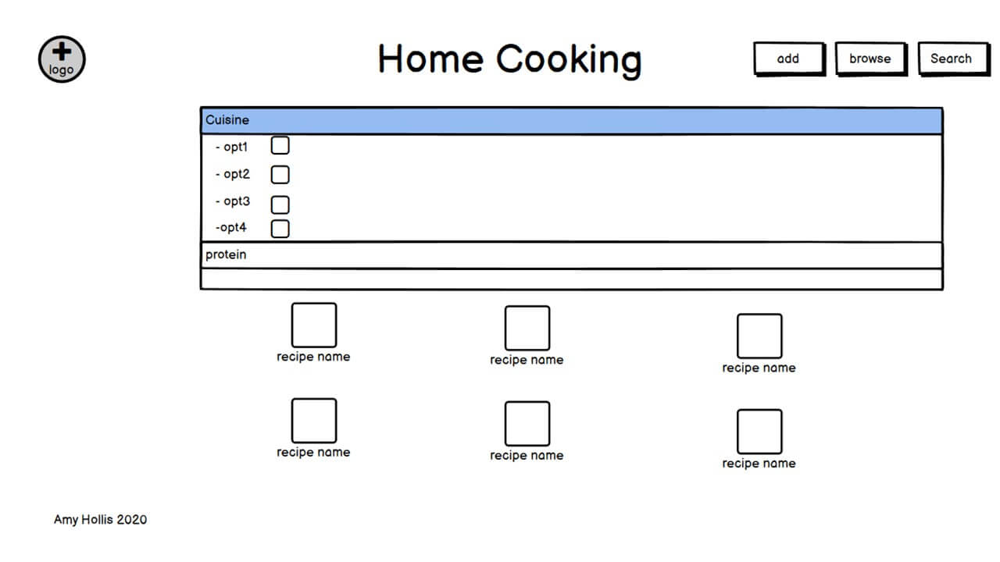
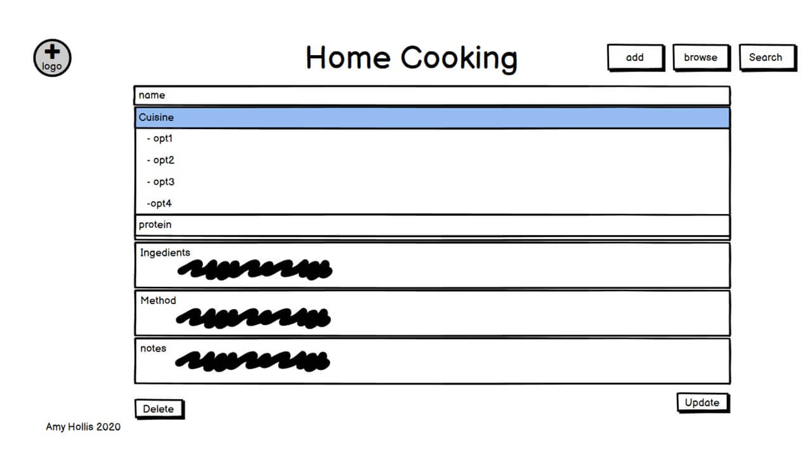

# Data Centric Development Milestone Project
## [Home Cooking](https://ms3-home-cooking.herokuapp.com/)
! image of final site here

This is a cooking recipe website that is added to by users. The website features a search and browsing page, and a page for users to add recipes. The main goal of the website is to build a bank of recipes that the site owners could then use  to publish a cookbook using the recipes posted on the website. 
The business goals of this website are:
-	Build brand awareness
-	Compile recipes to publish later in a recipe book
The user goals of the website are:
-	Search recipes based on specific requirements
-	Browse all recipes for inspiration 
-	Add recipes to the website for other users
-	Update recipes to help remove mistakes and errors 
## UX
### The ideal user for this site would be:
-	English speaking 
-	Passionate about cooking 
### Visitors to this website are searching for: 
-	Recipes the meet certain requirements
-	Browsing recipes for inspiration 
-	Wishing to add a recipe to the community 

This project is the best way to help users achieve what they are looking for because other similar recipe websites do not have the ability to search by different categories, such as diet requirements, allergies, protein source, carbs and type of cuisine, which this website offers. 
### User stories:
-	As a new visitor to the website I want to easily search for recipes that meet a set requirement.
-	As a frequent visitor to the website I want to be able to add recipes to share with other users. 
-	As a website user I want to be able to browse recipes regardless of what the recipe is to get inspiration
-	As a frequent user I want to be able to update recipes to help improve the integrity of the data and delete any duplicate recipes.

## Features
Across the website there will be a header and footer that are consistent, the footer will contain copyright information about who created the website. In addition it will help indicate to users that this is the bottom off the page as it is designed to be a scrolling webpage. The header will be relatively simple with a button-style menu, the website name and the logo (on the top left corner as per convention. One menu option will be a link to a page that anyone can access to an add a recipe page, a search page and the browse page (also the front page for the website) which can also be accessed through the logo. 

#### Home
The landing page for this website is the browse page. The page is made up of cards, each card features an image, title and as button that is linked to a python function that searches by a type of recipe. By using cards with images it adds interest to the page and encourages users to interact with it. This page will provide the read part of the CRUD methods.

#### Add recipe
This page is accessed through one of the buttons in the header. This page will consist of a form, that has input types, text, text area and checkboxes. The users will type the name, ingredients list, method and any notes. Checkboxes will be used for the cuisine type, protein source, carbs type, diet and allergies. I have chosen to use checkboxes for these as it means that what the users add to the dataset will match the options available for the search. In addition it will have a button at the bottom of the form so that the users can create the data in the database once they have checked that they are happy with what they have added. This is where I will have the create function as part of the CRUD methods that are used when handling data. 

#### Search recipes
The search page allows users to select the type of cuisine, protein source, carbs source and diet to search recipes. This page uses checkboxes because not only do ensure that the values match what is on the database, but also helps improve UX as site users are used to using checkboxes to select options. By using the “getlist” method in Flask I have enabled users to search for multiple values per key. This also provides the read functionality from the CRUD methods.  

#### Update recipe
The update page can be accessed through either the browse page or the search page. On both these pages users can see the cards with the recipes on when these cards are open the users can either close the card again or update the recipe. This update page is pre-populated with the current values so users can see the current data and update it. In addition this page features the delete button, therefore providing both the update and delete methods from the CRUD functionality. 

### Existing Features
-	Header logo, this element will appear on every page of the website. By clicking on it will return the user to the search/browse page as per convention. 
-	The navigation menu will also appear on all pages, this helps users make their way round the site. 
-	A footer element of a page (and appears on every page) protects copyrights of the business. 
-	A carousel will be featured on the landing page of the site, this will pe used to draw users in by showcasing some of the recipes available on the website. 
-	The Card elements on the pages provide an overview of the recipe by showing the users an image, the name and the notes about the recipe, this makes it easier for the users to digest the information. 
-	Forms have been used on the search, update and add pages. Not only is this a more user friendly way to search and input data but by using checkboxes the values on the search feature will match the values on the add page to ensure that all recipes can be found. 
-	A tag links have been used throughout the site to link to python functions to navigate through the website. 
### Features Left to Implement
-   A login page for a site admin. From this login page the site owners would be able to update and delete recipes (and remove it from public access) to help improve the integrity of the data. 
-   Another admin feature to implement on the admin site would be to log what the users search for, this would help the site users fulfil the business goals of the site as it would help them know what popular searches are, therefore know what recipes to put in the recipe book. 
## Technologies Used
Although this project is written in HTML, CSS, Javascript and Python, additional technologies were used to help with the production. 
-	This website has been hosted buy Heroku
-	I used the Gitpod IDE to write the code in. 
-	To simplify the structure of the site I used Bootstrap 
-	Bootstap requires jQuery to implement some of the elements. In addition I used it to help simplify traversing the DOM in my custom JavaScript 
-	Google Fonts were used to help style my website.
-   I used Material Design to help pick my colour scheme and find the hex codes for the colours that I used. Not only did it help me find the hex code for the main colour that I wanted, but it also gave the hex codes for a shade darker and lighter so that I could vary the website, while still having that consistency. 
-   In order to create the best UX possible I did not want users to have to wait a long time for the browser to load large image files, so I used Tiny PNG to compress my images so the file sizes are smaller and therefore load faster. 
-   Once I had finished coding I used this HTML Formatter to ensure that my code was properly laid out and easier to read, this site also formats CSS and JavaScript. 
-   I used the W3C validators to help test my code. I used the HTML validator and the CSS validator to ensure that both coding languages were correct.
## Testing
!need to do once site is finished
## Deployment
To deploy the project from Heroku using the Heroku Toolbelt, the following steps were taken: 
1)	Log in to Heroku and click the “new” dropdown button on the dashboard and select “create new app”
2)	Name your app (the name must be unique) and ensure the correct region has been set for where you are. 
3)	Click “create app”.
4)	In the terminal in your app type “npm install -g heroku” and hit enter to install Heroku into your app. The “-g” installs Heroku globally across your project. 
5)	Log in to Heroku in the terminal using “Heroku login -I” then input your email address and password for Heroku. 
6)	To add Heroku to your git type “git remote add” then what you want to call it (I have used “heroku”) then  pate the git URL from the settings page on Heroku, this URL should follow the format of https://git.heroku.com/projectname.git
7)	If you do not already have a requirements.txt file use the following command as Heroku will need this file to determine that it is a Python project. “pip3 freeze -- local > requirements.txt”
8)	To create a Procfile (this tells Heroku how to run the project) use the following command in the terminal “echo web: python app.py (or what you’ve named your Python file) > Procfile”. Make sure that Procfile has a capital P. 
9)	To push this all to Heroku use “git add . -u heroku master” , then you can use git commit and git push to commit and push to Heroku. 
10)	As this project uses an env.py file we need to add these settings to Heroku as they have not been pushed by git as it is in the gitignore file. Back in Heroku go to the settings page. Click on “reveal config vars” Here you are going to add three Key-Value pairs. The first has a key of “IP” and the value is 0.0.0.0. Then you’re going to create a “PORT” key with the value of 5000. Then you are going to add any secret keys (or in this case “MONGO_URI”) from the env.py file (make sure you don’t include any quote marks here). 
11)	You can then open the app (if this is not working straight away use the “Restart all dynos” under the “more” dropdown to manually restart the build)
-	If you are doing this, make sure you specify where you push to when updating, to push to GitHub again, rather than to Heroku, do “git add . -u origin”
To deploy automatically from GitHub:
1)	Follow steps 1-3 from above
2)	 Click on the “deploy” tab in Heroku then choose “connect to GitHub”
3)	Your username will already be set, so you just need to add the reop name and click “search”
4)	Once you are sure that it has found the correct reop, click “connect”
5)	Scroll down and check it is deploying the master branch then select “enable Automatic Deploys” then “Deploy Branch”
## Credits
### Content
!source recipe websites/books
### Media
!add full list once CSS is done
## Acknowledgements
-   I was given feedback and advice from [Akshat Garg](https://github.com/akshatnitd).
-   I received technical support and advise from the tutors at Code Institute.
Disclaimer
This project was created for educational purposes.

