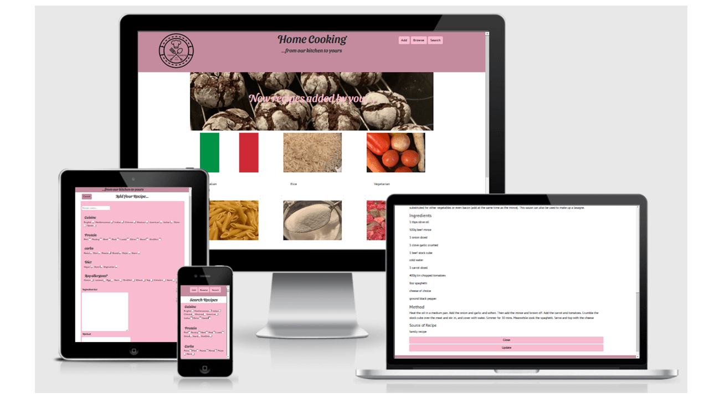

# Data Centric Development Milestone Project
## [Home Cooking](https://ms3-home-cooking.herokuapp.com/)

This is a cooking recipe website that is added to by users. The website features a search and browse page, and a page for users to add recipes. The main goal of the website is to build a bank of recipes that the site owners could then use  to publish a cookbook using the recipes posted on the website. 
The business goals of this website are:
-   Build brand awareness.
-   Compile recipes to publish later in a recipe book.

The user goals of the website are:
-   Search recipes based on specific requirements.
-   Browse all recipes for inspiration. 
-   Add recipes to the website for other users.
-   Update recipes to help remove mistakes and improve the integrity of the data. 
## UX
### The ideal user for this site would be:
-   English speaking.
-   Passionate about cooking.
### Visitors to this website are searching for: 
-   Recipes that meet certain requirements.
-   Browsing recipes for inspiration.
-   Wishing to add a recipe to the community. 

This project is the best way to help users achieve what they are looking for because other similar recipe websites do not have the ability to search by different categories, such as dietary requirements, protein source, carbs and type of cuisine, which this website offers. In addition, they do not all allow users to search for inspiration based off one defining feature.
### User stories:
-   As a new visitor to the website I want to easily search for recipes that meet a set of requirements.
-   As a frequent visitor to the website I want to be able to add recipes to share with other users. 
-   As a website user I want to be able to browse recipes regardless of what the recipe is to get inspiration.
-   As a frequent user I want to be able to update recipes to help improve the integrity of the data and delete any duplicate recipes.
-   As a first-time visitor to the website I want to be drawn into the website by being given a preview of what sort of recipes to expect. 

## Features
Across the website there will be a header and footer that are consistent. The footer will contain copyright information about who created the website and social media links to the images. In addition, it will help indicate to users that this is the bottom off the page. The site is designed to be a scrolling webpage as it is dynamically created so it does not matter how many results are returned. The header will be relatively simple with a button-style menu, the website name and the logo (in the top left corner as per convention). Each menu option will be a link to either, an add a recipe page, a search page or the browse page (also the front page for the website) which can be accessed through the link in the logo. 

#### Home
The landing page for this website is the browse page. At the top of the page will be a carousel showing images of recipes that have been recently added, so will change over time.The rest of the page is made up of cards, each card was meant to feature an image, title and a button that is linked to a python function that searches by a type of recipe. However, after feedback I decided to make the title the button as it made the cards look neater and could link to the pre-existing search function in my Python code, thus reducing the repetition I my code. By using cards with images, it adds interest to the page and encourages users to interact with it. This page will provide the read part of the CRUD methods.

#### Add recipe
This page is accessed through one of the buttons in the header. This page will consist of a form, that has input types, text, text area and checkboxes (during development a url type was added to ensure that users added a url with a link for the image). The users will type the name, ingredients list, method, any notes and the orignal source of the recipe. Checkboxes will be used for the cuisine type, protein source, carb source, diet and allergies. I have chosen to use checkboxes for these as it means that what the users add to the dataset will match the options available for the search, in addition, unlike select options, users can select multiple values per key. Additionally, it will have a button at the bottom of the form so that the users can add the data to the database once they have checked that they are happy with what they have added. After user feedback I have added a cancel button at the top of the page that gives users the option to return to the search page without adding a recipe. This is where I will have the create function as part of the CRUD methods that are used when handling data. 

#### Search recipes
The search page allows users to select the type of cuisine, protein source, carbs source and diet to search recipes by using the Mongo .find() method. This form uses checkboxes because not only do they ensure that the values match what is on the database, but also helps improve UX as site users are used to using checkboxes to select options. By using the .getlist() method in Flask I have enabled users to search for multiple values per key. This also provides the read functionality from the CRUD methods.  

#### Update recipe
The update page can be accessed through a recipe card on the search page.  This update page is pre-populated with the current values so users can see what is already there and update it using the .updateOne() method. In addition, this page features the delete button (using the .remove() function from Mongo), therefore providing both the update and delete methods from the CRUD functionality. 

### Existing Features
-   **Header logo**, this element will appear on every page of the website (on larger viewports). By clicking on it will return the user to the landing/browse page as per convention. 
-   The **navigation menu** will also appear on all pages; this helps users make their way round the site. 
-   A **footer** element of a page (and appears on every page) protects the copyrights of the business. 
-   A **carousel** will be featured on the landing page of the site; this will be used to draw users in by showcasing some of the recipes available on the website. 
-   The **card elements** on the search page provide an overview of the recipe by showing the users an image and the name and a bit about the recipe and any allergens in that recipe. Breaking the information down like this makes it easier for the users to digest.
-   **Forms** have been used on the search, update and add pages. Not only is this a more user-friendly way to search and input data but by using checkboxes but ensures the values on the search feature will match the values on the add page so that all recipes can be found. 
-   **A tag** links (with Flask's url_for) have been used throughout the site to link to Python functions to navigate through the website. 
### Features Left to Implement
-   A **login page** for a site admin. From this login page the site owners would be able to update and delete recipes (and remove these functions from public access) to help improve the integrity of the data. 
-   Another admin feature to implement on the admin site would be to log what the users search for, this would help the site users fulfil the business goals of the site as it would help them know what popular searches are, therefore know what recipes to put in the recipe book. 
-   In order to improve the performance of the website, **alternative storage** options for the images would be used. This is because the website owners would need the rights to the images in order to publish them, and by reducing the number of external resources used to load the page would speed up the loading times, and therefore improve the overall user experience. 
## Technologies Used
Although this project is written in HTML, CSS, Javascript and Python, additional technologies were used to help with the production. 
-   To help with the planning of this project I created wireframes using [Balsamiq]( https://balsamiq.com/)
-   This website has been hosted buy [Heroku](https://signup.heroku.com/?c=70130000000NeLCAA0&gclid=Cj0KCQiA0MD_BRCTARIsADXoopaEeaocIxNG5UtKhSYyKwifURCrA--M2sjFm3FVTqgklSk-QJCKNPEaAnqSEALw_wcB)
-   I used the [Gitpod](https://gitpod.io/workspaces/) IDE to write the code in and stored it in [GitHub](https://github.com/Amyh97). 
-   The data has been stored in [Mongo DB](https://account.mongodb.com/account/login).
-   To simplify the structure of the site I used the [Bootstrap](https://getbootstrap.com/) CSS libary.
-   Bootstap requires [jQuery](https://jquery.com/) to implement some of the elements. In addition, I used it to help simplify traversing the DOM in my custom JavaScript. 
-   [Google Fonts](https://fonts.google.com/) were used to help style my website.
-   I used [Material Design](https://material.io/resources/color/#!/?view.left=0&view.right=0) to help pick my colour scheme and find the hex codes for the colours that I used. Not only did it help me find the hex code for the main colour that I wanted, but it also gave the hex codes for a shade darker and lighter so that I could vary the website, while still having that consistency. 
-   In order to create the best UX possible I did not want users to have to wait a long time for the browser to load large image files from the repository, or Imgur so I used [Tiny PNG](https://tinypng.com/) to compress my images so the file sizes are smaller and therefore load faster. 
- I converted my logo into a favicon by using [xiconeditor](http://www.xiconeditor.com/).
-   Once I had finished coding, I used this [Web Formatter](https://webformatter.com/html) to ensure that my code was properly laid out and easier to read, this site also formats CSS and JavaScript. 
-   To format my Python code, I used [Code Beautify](https://codebeautify.org/python-formatter-beautifier).
-   I used the W3C validators to help test my code. I used the [HTML validator](https://validator.w3.org/#validate_by_input) and the [CSS validator](https://jigsaw.w3.org/css-validator/#validate_by_input) to ensure that both coding languages were correct.
-   To validate my Javascript I used [JS Hint](https://jshint.com/).
-   I used [PEP8](http://pep8online.com/) to validate my Python code.
## Testing

Please see [testing.md](testing.md) for documentation on testing and the issues faced and their resolutions.

## Deployment
#### To deploy the project from Heroku using the Heroku Toolbelt: 
1)  Log in to Heroku and click the “new” dropdown button on the dashboard and select “create new app”
2)  Name your app (the name must be unique) and ensure the correct region has been set for where you are. 
3)  Click “create app”.
4)  In the terminal in your app type “npm install -g heroku” and hit enter to install Heroku into your app. The “-g” installs Heroku globally across your project. 
5)  Log in to Heroku in the terminal by using “Heroku login -I” then input your email address and password for Heroku. 
6)  To add Heroku to your git, type “git remote add” then what you want to call it (I have used “heroku”) then  paste the git URL from the settings page on Heroku, this URL should follow the format of https://git.heroku.com/projectname.git
7)  If you do not already have a requirements.txt file use the following command as Heroku will need this file to determine that it is a Python project. “pip3 freeze -- local > requirements.txt”
8)  To create a Procfile (this tells Heroku how to run the project) use the following command in the terminal “echo web: python app.py (or what you’ve named your Python file) > Procfile”. Make sure that Procfile has a capital P. 
9)  To push this all to Heroku use “git add . -u heroku master” , then you can use git commit and git push to commit and push to Heroku. 
10) As this project uses an env.py file you need to add these settings to Heroku as they have not been pushed by git as it is in the gitignore file. Back in Heroku go to the settings page. Click on “reveal config vars” Here you are going to add three Key-Value pairs. The first has a key of “IP” and the value is 0.0.0.0. Then you are going to create a “PORT” key with the value of 5000. Then you are going to add any secret keys (or in this case “MONGO_URI”) from the env.py file (make sure you do not include any quote marks here). 
11) You can then open the app (if this is not working straight away use the “Restart all dynos” under the “more” dropdown to manually restart the build)
-   If you are doing this, make sure you specify where you push to when updating, to push to GitHub again, rather than to Heroku, do “git add .”, "git commit" and then "git push -u origin".

#### To deploy automatically from GitHub:
1)  Follow steps 1-3 from above
2)   Click on the “deploy” tab in Heroku then choose “connect to GitHub”
3)  Your username will already be set, so you just need to add the reop name and click “search”
4)  Once you are sure that it has found the correct reop, click “connect”
5)  Scroll down and check it is deploying the master branch then select “enable Automatic Deploys” then “Deploy Branch”
6)  Pick up above instructions again from step 10.

#### To clone this project from GitHub:

 1)   Under the repository name, click "Clone or download".
 2)   In the Clone with HTTPs section, copy the clone URL for the repository.
 3)   In your local IDE open Git Bash.
 4)  Change the current working directory to the location where you want the cloned directory to be made.
 5)   Type git clone, and then paste the URL you copied in Step 3.

git clone https://github.com/Amyh97/milestoneProject3

  6)  Press Enter. Your local clone will be created. The requitements.txt file will imform you what needs to be installed in order to run the project (in addition, an env.py file will need to be created with the secret key for the MONGO_URI)

Further reading and troubleshooting on cloning a repository from GitHub [here]( https://help.github.com/en/articles/cloning-a-repository
).
## Credits
### Content
In order to ensure what all recipe content is credited; this detail is added to the results card and is part of the add recipe form (as a required field) so new recipes added also have this information on it. 
### Media
- To create my logo, I used a website called [LogoMakr](https://logomakr.com/) which is also credited in the footer as per website instructions.
- To get the picutures for the cards on the browse page containing the [Pork](https://pngtree.com/so/delicious-pork-belly) and [Poultry](https://pngtree.com/so/animal) foods, I used pngtree.com.
- The [Italian Flag](https://en.wikipedia.org/wiki/File:Flag_of_Italy.svg) image came from Wikipedia.
- The [Mexican Flag](https://commons.wikimedia.org/wiki/File:Mexican_flag.png) came from Wikimedia.
- Other images that are used throughout the project are myown that have been saved and put into the [GitHub](https://github.com/Amyh97/milestoneProject3) repositary (such as the logo, favicon and images used in the testing and Readme files).
- All [other photos](https://imgur.com/user/Amyh97/posts)  on cards and the carousel are my own that have been hosted on Imgur.
## Acknowledgements
-   I was given feedback and advice from [Akshat Garg](https://github.com/akshatnitd).
-   I received technical support and advise from the tutors at Code Institute.
## Disclaimer
This project was created for educational purposes.

