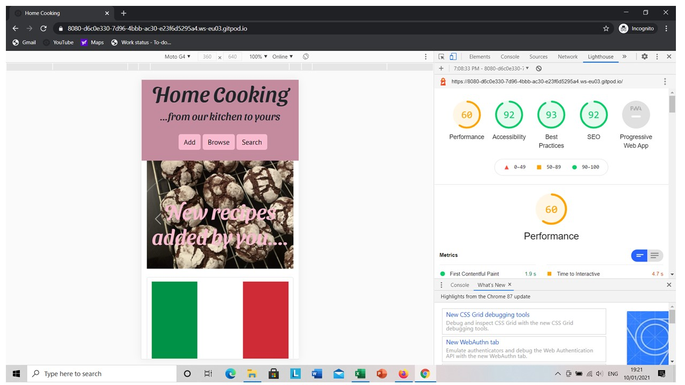

# Testing

The first step that I took in testing my code was to use the W3C Validators for both [HTML](https://validator.w3.org/) and [CSS](https://jigsaw.w3.org/css-validator/), then validated my JavaScript with [JS Hint](https://jshint.com/) and used [PEP8](http://pep8online.com/) to validate my Python code. I then went on to check the console for any errors while interacting with my site and checked the Python terminal for any error codes caused by these interactions. 

Once I was sure the code was valid and correct, I moved on to testing it from a user perspective. First, I checked that all the internal links on the navbar went to the correct pages and the browse cards showed the correct search. Once I had checked the links went to the correct locations, I made sure that the Javascript on my cards worked correctly and opened and closed the recipes. After these had all been tested, I turned to my user stories to check that the site preformed as users would want.
-   As a new visitor to the website I was able to search for recipes based on set requirements by using the search page that I was accessed through the menu in the header.
-   As a frequent visitor to the website I was able to add a recipe to the website by using the form on the add page that was accessed throught the menu. Once this was done a message was flashed up on screen to let me know that this had been done successfully. 
-   As a website user I could browse recipes regardless of what the recipe is to get inspiration. I did this by using the cards on the browse page of the site. Each card showed me a different criterion (e.g., Italian foods) that, when clicked on showed me all recipes that matched.
-   As a frequent user I could update recipes to help improve the integrity of the data and delete any duplicate recipes. I did this by opening a recipe card and clicking on the update button. From  here I could use the delete button at the top of this page or I could see what data was already in the dataset and make any modifications needed. After either deleting or updating the selected recipe a message was shown to let me know that this was done successfully.
-   As a first-time visitor to the website I was drawn into the website by being given a preview of what sort of recipes to expect on the website in the carousel on the lading page. 

The next step I took in testing my website was to add, search for, update and delete test recipes to check that the functions worked properly. After this, I sent my site for peer review. From this I adjusted my JavaScript on my recipe cards so that once it was opened users did not have to scroll to find the open recipe as all other cards were hidden. In addition, I made some minor adjustments to the CSS (such as align form elements by adding line breaks) and to change the input type for the image field (on both the add and update pages) to URL so that users had to enter a web address starting with either http:// or https:// to provide an image location. It was through this feedback that I was advised to add the flash messages to improve the user experience. 

I then used the developer tools in my browser to manipulate the website to render as if on different screen sizes. On the smaller screen sizes, I hid the logo element as the header was taking up much of the screen. In addition, I removed some margin around the card elements on mobile devises as to best utilise the space available. 

Once I was happy with how the website worked and looked, I opened my website in Google Chrome and used [Lighthouse](https://developers.google.com/web/tools/lighthouse) to test performance, accessibility and best practice on my website. When I first ran this test the performance category was under performing. I investigated the reasons for this and found that one of the major issues was the length of time it took to load the images from Imgur (where I hosted the images for this site). To help overcome this I removed all the images from Imgur and ran them through [Tiny Png](https://tinypng.com/). After this I was able to add the images back on to Imgur (this site was used as other sites such as Dropbox, Flickr and Google Drive had security settings that would not allow me to copy an image location url to add to the database). These smaller images sizes made a significant impact and brought the performance score out of the red and up to 60/100 on my browse page (as below). I then investigated the other reasons why this score was 60. 
I found that what was slowing down the performance of the page was external libaries such as bootstrap, JSdeliver and Jquery as well as retrieving data from Imgur. This became more evident as I ran the same tests on the search page and the add pages of my website. On the add page there is no interaction with Imgur and the performance score was 72/100, but on the search page where there is the most interaction with both Imgur and MongoDb and this score was lower. However, all the pages have the third-party links in them as they are all an extention of base.html, therefore I was unable to remove unsed links for each page. As stated in the features left to implement section of the main [Readme](readme.md) file, a future feature to implement would be an option for the users to upload the image straight to the website, therefore removing Imgur from the equation, thus speeding up the performance of the site. 

## Issues and Resolutions
While developing this project I faced a few issues. One of which was the data not prepopulating in all fields in the update form. I had the data in a for loop, which was filling in the text fields but not the checkboxes. In order to overcome this, I needed to add another for loop inside the original for loop, this looked at the array in the dataset and then separated out the values. Once I had worked that out this method has been used again on the recipe cards to put the ingredients in a list to make them easier to read and as not to print escaped characters and again in the overview cards to show allergens. 

When I sent my project for peer review it was viwed on different devices imcluding Android phones and iOS phones. From this I found that the carousel on the browse page was not cycling through on the Android phone. This led to further testing and research. When tested on a newer Android phone the carousel worked as expected. After some reading, I found that there were some issues with Bootstrap elements on the older Android phones, but in order to overcome this issue so as many people could use my site as possible, I updated the carousel to include controll arrows, this seemed to work on the older Android phones as well as the other devises.
